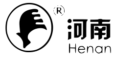
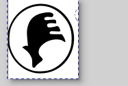

# SVG

打开图片
--------------------------------------------------------------------------

转换
--------------------------------------------------------------------------
工具栏中依次选择 `Path` → `Trace Bitmap`. 微调后选择 'Apply', 主区域将出现一个位图层。把鼠标移动到位图层稍微往下拖拽，使下面原始的图片露出来。删除原始图片，只保留位图。最终效果如图：

裁剪
--------------------------------------------------------------------------
我们只要圆圈内的标志。先把图片进行粗略的裁剪，只留下圆圈部分。

1. 创建一个矩形. 划出包含圆圈的矩形。
2. 按住 Shift. 先点击矩形左上角的小方框使其选中，再点击原始位图其它部分使其也处于选中状态。操作后，两个区域四周会出现虚线框；
3. 在虚线框内右键单击，选择 `Set Clip`, 无关部分就会被移除，只保留我们关心的部分；
4. 在 `File` → `Document Properties` 页面, 点击 'Resize to content` 按钮，将文档进一步缩小；

最终效果如图：

去掉外侧的圆圈
--------------------------------------------------------------------------
点击“橡皮”图标，擦除外侧的圆圈。

导出
--------------------------------------------------------------------------
选择一个合适的颜色后，就可以导出了。导出操作有四个选项卡：Document, Page, Selection 和 Custom. 'Selection' 可以通过选择感兴趣的区域局部导出。

导出格式直接选择 .svg 即可，方便后期重复使用。

